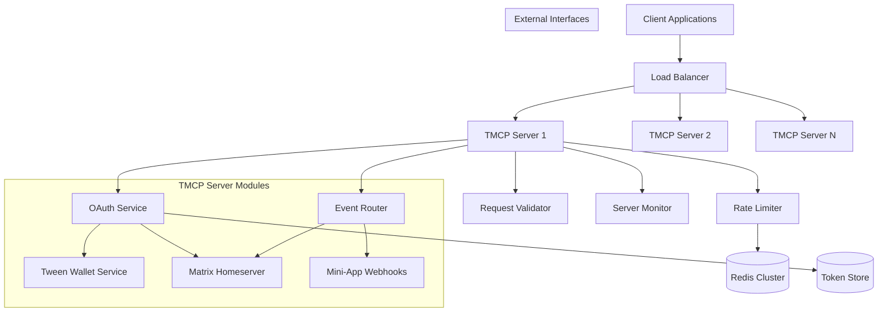
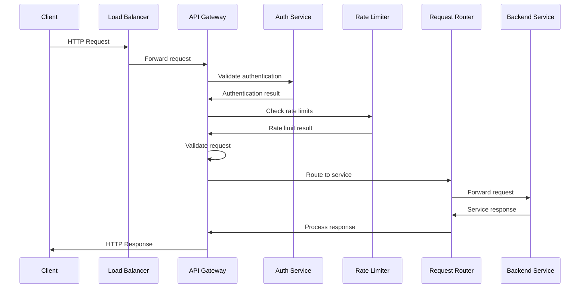
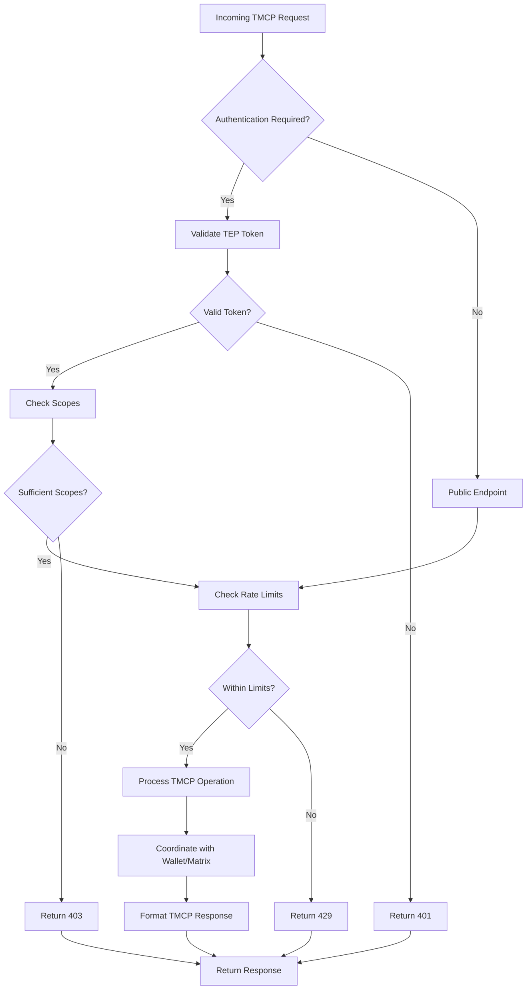
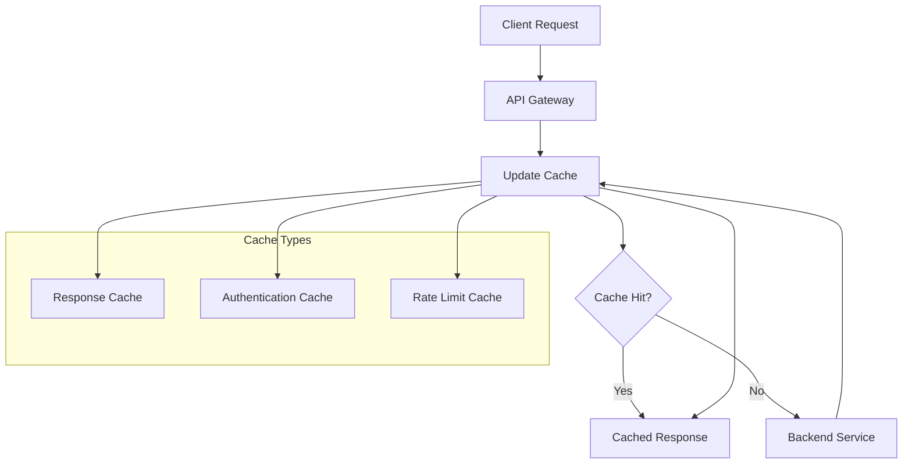

# TMCP Server Request Routing and API Design

## 1. Overview

The TMCP Server implements the Matrix Application Service API and serves as the single entry point for all TMCP protocol operations. It handles request routing, authentication, rate limiting, and protocol coordination as defined in the TMCP protocol specification.

## 2. System Architecture



## 3. Request Flow

### 3.1 Request Processing Pipeline



### 3.2 Request Routing Decision Tree



## 4. TMCP Server Components

### 4.1 OAuth Service (Protocol Section 4.2)

**Responsibilities:**
- TEP token validation and extraction (Protocol Section 4.3)
- JWT signature verification for TMCP tokens
- Token expiration and scope checking
- User context extraction from Matrix identity

**Implementation:**
```javascript
class AuthenticationHandler {
  async validateToken(request) {
    const token = this.extractToken(request);
    if (!token) return null;
    
    const payload = await this.verifyJWT(token);
    if (!payload || this.isExpired(payload)) return null;
    
    return {
      userId: payload.sub,
      appId: payload.app_id,
      scopes: payload.scp,
      expiresAt: payload.exp
    };
  }
}
```

### 4.2 Rate Limiter (Protocol Section 11.4.1)

**Responsibilities:**
- Rate limit enforcement per protocol requirements
- Distributed rate limiting across TMCP server instances
- Required rate limit headers (X-RateLimit-*)
- Configurable policies for different operations

**Rate Limiting Implementation (Protocol Compliant):**
1. **Token Bucket Algorithm** - Required by protocol
2. **Sliding Window Counters** - For precise control
3. **Distributed Storage** - Redis-backed for multi-instance

**Configuration (Protocol Section 11.4.1):**
```yaml
rate_limits:
  default:
    requests_per_minute: 100
    burst: 20

  oauth_endpoints:
    requests_per_minute: 10
    burst: 5

  payment_operations:
    requests_per_minute: 30
    burst: 10

  wallet_resolution:
    requests_per_minute: 100
    burst: 20
```

### 4.3 Event Router (Protocol Section 3.1.2)

**Responsibilities:**
- Route Matrix events to mini-apps via webhooks
- Handle TMCP protocol communication verbs
- Coordinate with Matrix homeserver
- Manage mini-app webhook subscriptions

**TMCP API Endpoints (Protocol Compliant):**
```yaml
tmcp_endpoints:
  - path: "/oauth2/*"
    operation: "OAuth 2.0 flows (Section 4.2)"
    auth_required: false

  - path: "/api/v1/wallet/*"
    operation: "Wallet operations (Section 6)"
    auth_required: true
    scopes: ["wallet:balance", "wallet:pay"]

  - path: "/api/v1/storage/*"
    operation: "Mini-app storage (Section 10.3)"
    auth_required: true
    scopes: ["storage:read", "storage:write"]

  - path: "/_matrix/app/v1/*"
    operation: "Matrix Application Service API"
    auth_required: true
```

### 4.4 Request Validator

**Responsibilities:**
- Request schema validation
- Input sanitization
- Size limits enforcement
- Content type validation

**Validation Rules:**
```json
{
  "validation_rules": {
    "max_request_size": "10MB",
    "max_header_size": "8KB",
    "allowed_content_types": [
      "application/json",
      "application/x-www-form-urlencoded",
      "multipart/form-data"
    ],
    "sanitization": {
      "remove_html": true,
      "trim_strings": true,
      "normalize_unicode": true
    }
  }
}
```

## 5. TMCP Protocol Compliance

### 5.1 Protocol Implementation

The TMCP Server implements the complete TMCP protocol specification:

**Core Protocol Elements:**
- OAuth 2.0 + PKCE authentication (Section 4.2)
- TEP token management (Section 4.3)
- Scope-based authorization (Section 5)
- Wallet integration (Section 6)
- Payment processing with MFA (Section 7)
- Event system (Section 8)
- Mini-app lifecycle (Section 9)
- Storage system (Section 10.3)

### 5.2 Matrix Application Service Integration

**AS Registration (Protocol Section 3.1.2):**
```yaml
id: tween-miniapps
url: https://tmcp.internal.example.com
as_token: <APPLICATION_SERVICE_TOKEN>
hs_token: <HOMESERVER_TOKEN>
sender_localpart: _tmcp
namespaces:
  users:
    - exclusive: true
      regex: "@_tmcp_.*"
    - exclusive: true
      regex: "@ma_.*"
  aliases:
    - exclusive: true
      regex: "#_tmcp_.*"
```

### 5.3 Communication Patterns

**Client-to-Server (Protocol Section 3.2.1):**
- Matrix Protocol: Client ↔ Matrix CS API ↔ Homeserver
- TMCP Protocol: Mini-App ↔ TMCP Bridge ↔ TMCP Server ↔ Wallet Service

## 6. Security Implementation (Protocol Compliant)

### 6.1 TMCP Security Headers

```http
Strict-Transport-Security: max-age=31536000; includeSubDomains
Content-Security-Policy: default-src 'self'; frame-ancestors 'none'
X-Content-Type-Options: nosniff
X-Frame-Options: DENY
Referrer-Policy: strict-origin-when-cross-origin
```

### 6.2 Protocol Security Features

**TEP Token Security (Protocol Section 4.3):**
- JWT format with RS256 signing
- Short expiration (1 hour recommended)
- Scope-based access control
- Hardware-backed signing for payments

**MFA Integration (Protocol Section 7.4):**
- Transaction PIN, biometric, and TOTP support
- Device registration for biometrics
- Challenge-response authentication

**Wallet Security:**
- Hardware security module integration
- Biometric attestation
- Secure key storage

### 6.3 Mini-App Sandboxing

**Content Security Policy (Protocol Section 3.3):**
- WebView/iframe isolation
- Restricted API access
- Secure communication bridge
- Permission-based access control

## 7. Performance Optimization

### 7.1 Caching Strategy



**Cache Configuration:**
```yaml
cache:
  response_cache:
    ttl: 300  # 5 minutes
    max_size: 100MB
    vary_by: ["Authorization", "Accept-Language"]
  
  auth_cache:
    ttl: 60   # 1 minute
    max_size: 50MB
    
  rate_limit_cache:
    ttl: 3600  # 1 hour
    max_size: 200MB
```

### 7.2 Connection Pooling

**Backend Connection Pools:**
- HTTP/2 connection multiplexing
- Keep-alive connections
- Connection timeout configuration
- Circuit breaker implementation

**Database Connection Pools:**
- Read/write splitting
- Connection health checks
- Automatic failover
- Connection retry logic

## 7. Monitoring and Observability

### 7.1 TMCP Server Metrics

**Protocol Metrics:**
- TEP token validation success/failure rates
- Scope usage statistics
- MFA challenge completion rates
- Wallet operation response times

**Matrix Integration Metrics:**
- Event routing success rates
- Webhook delivery statistics
- Matrix API call latencies
- Room membership validations

### 7.2 Distributed Tracing

**TMCP Request Tracing:**
```
X-Trace-Id: unique-trace-identifier
X-TMCP-Version: v1.2.0
X-Protocol-Operation: wallet_balance|payment_initiate|etc
```

## 8. Error Handling (Protocol Section 12.2)

### 8.1 TMCP Error Response Format

```json
{
  "error": {
    "code": "MFA_REQUIRED",
    "message": "Multi-factor authentication is required for this payment",
    "details": {
      "payment_id": "uuid",
      "mfa_methods": ["transaction_pin", "biometric", "totp"]
    },
    "request_id": "req_123456789",
    "timestamp": "2025-12-20T01:15:00Z"
  }
}
```

### 8.2 Protocol Error Codes

| Error Code | HTTP Status | Protocol Section |
|------------|-------------|------------------|
| MFA_REQUIRED | 428 | 7.4 |
| MFA_FAILED | 401 | 7.4 |
| INSUFFICIENT_FUNDS | 402 | 7.2 |
| RECIPIENT_NO_WALLET | 404 | 6.3 |
| INVALID_SCOPE | 403 | 5 |

## 9. Protocol Compliance Summary

This TMCP Server design fully implements the TMCP protocol specification:

- **Application Service Architecture**: Integrated Matrix AS with all protocol modules
- **OAuth 2.0 + PKCE**: Complete authentication flow with TEP tokens
- **Wallet Integration**: Direct coordination with Tween Wallet Service
- **Payment Processing**: MFA-enabled payments with state machine
- **Event Routing**: Matrix event handling and webhook delivery
- **Security**: Protocol-compliant security measures and rate limiting
- **Matrix Integration**: Proper AS registration and event handling

The design ensures TMCP protocol compliance while providing a robust, secure, and scalable implementation for mini-app ecosystem management.