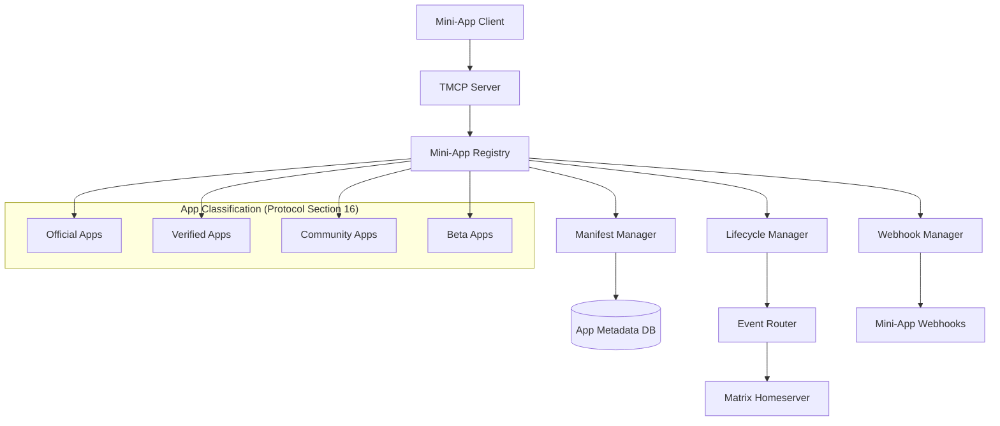
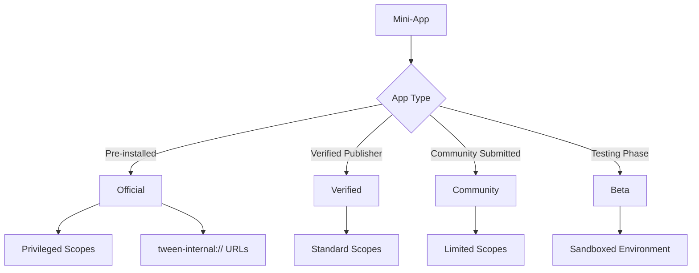
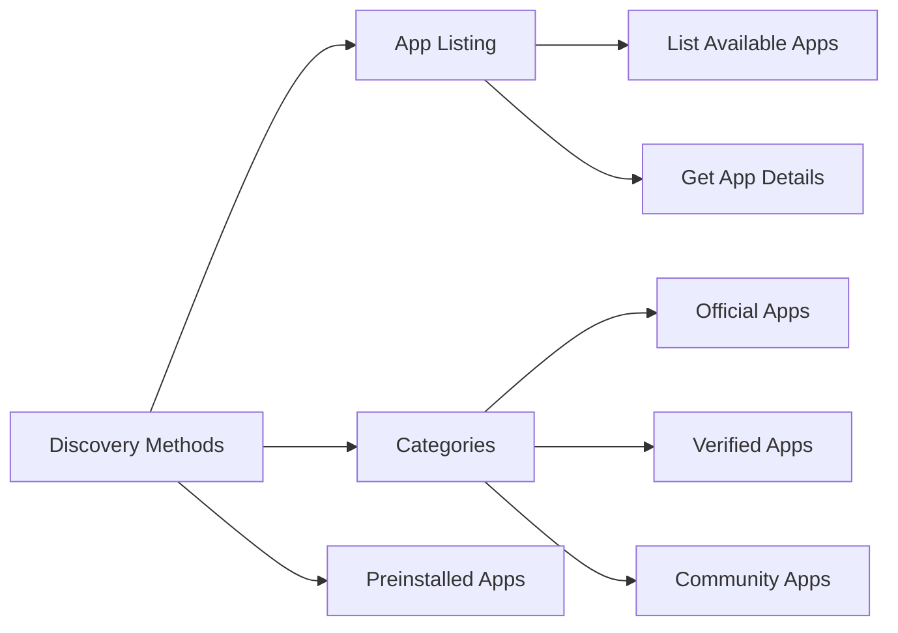
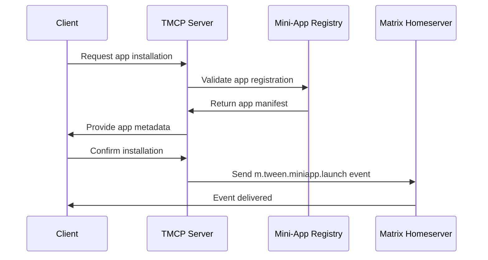

# TMCP Mini-App Registry and Lifecycle Management

## 1. Overview

The TMCP Mini-App Registry provides protocol-compliant mini-app registration, lifecycle management, and basic discovery as specified in the TMCP protocol. It implements the Mini-App Registry module of the TMCP Server (Protocol Section 3.1.2) without extending beyond protocol requirements.

## 2. System Architecture



## 3. App Classification System

### 3.1 App Categories



### 3.2 Classification Criteria

| Category | Criteria | Privileges |
|----------|----------|------------|
| Official | Developed by Tween team | Full privileged scopes, internal URLs |
| Verified | Verified publisher identity | Standard scopes, enhanced visibility |
| Community | Community submitted | Basic scopes, standard review |
| Beta | Testing phase | Sandboxed, limited distribution |

## 4. Mini-App Discovery (Protocol Compliant)

### 4.1 Basic Discovery Methods

The TMCP protocol specifies basic app discovery without advanced search features:



### 4.2 App Classification (Protocol Section 16)

**Official Apps:** Preinstalled and privileged (tween-internal:// URLs)
**Verified Apps:** Publisher-verified with standard scopes
**Community Apps:** Basic community submissions
**Beta Apps:** Testing phase with sandboxed environment

## 5. App Classification Criteria (Protocol Section 16)

### 5.1 Classification Rules

| Category | Criteria | Privileges | Protocol Reference |
|----------|----------|------------|-------------------|
| Official | Developed by Tween team | Full scopes, internal URLs | Section 16.1 |
| Verified | Verified publisher identity | Standard scopes | Section 16.2 |
| Community | Community submitted | Basic scopes | Section 16.3 |
| Beta | Testing phase | Sandboxed environment | Section 16.4 |

### 5.2 Scope Assignment

**Official Apps:** All available scopes including privileged
**Verified Apps:** Standard scopes (user:*, wallet:*, messaging:*)
**Community Apps:** Limited scopes (storage:*, basic user:*)
**Beta Apps:** Sandboxed with minimal scopes

## 6. Mini-App Lifecycle Management (Protocol Section 9)

### 6.1 Installation Flow (Protocol Section 9.1)



### 6.2 Lifecycle Events (Protocol Section 8.1.4)

**Matrix Events for App Lifecycle:**
- `m.tween.miniapp.launch` - App launched
- `m.tween.miniapp.install` - App installed
- `m.tween.miniapp.update` - App updated
- `m.tween.miniapp.uninstall` - App uninstalled

### 6.3 Preinstallation System (Protocol Section 16)

**Preinstallation Manifest (Protocol Compliant):**
```json
{
  "version": "1.0",
  "preinstalled_apps": [
    {
      "app_id": "ma_browser_001",
      "name": "Tween Browser",
      "version": "2.1.0",
      "url": "tween-internal://browser",
      "classification": "official",
      "required": true,
      "auto_update": true,
      "scopes": ["privileged", "system"]
    }
  ]
}
```

## 7. Registry API Design (Protocol Compliant)

### 7.1 Basic Discovery APIs

```
GET /api/v1/apps - List available apps by classification
GET /api/v1/apps/{appId} - Get app details and manifest
GET /api/v1/apps/classification/{type} - Get apps by classification
```

### 7.2 Lifecycle APIs

```
POST /api/v1/apps/{appId}/install - Register app installation
POST /api/v1/apps/{appId}/uninstall - Register app uninstallation
GET /api/v1/apps/{appId}/status - Get installation status
```

### 7.3 Management APIs (Official Only)

```
POST /api/v1/admin/apps - Register new mini-app
PUT /api/v1/admin/apps/{appId} - Update app metadata
DELETE /api/v1/admin/apps/{appId} - Remove app registration
POST /api/v1/admin/preinstall - Update preinstallation manifest
```

## 8. Data Models

### 8.1 Mini-App Model (Protocol Compliant)

```json
{
  "app_id": "ma_browser_001",
  "name": "Tween Browser",
  "description": "Fast and secure web browser",
  "version": "2.1.0",
  "classification": "official",
  "developer": {
    "name": "Tween Inc.",
    "verified": true
  },
  "manifest": {
    "permissions": [
      "storage:read",
      "storage:write",
      "network:access"
    ],
    "scopes": ["privileged", "system"],
    "launch_url": "tween-internal://browser"
  },
  "metadata": {
    "icon_url": "https://cdn.tween.com/icons/browser.png",
    "support_url": "https://tween.com/support"
  },
  "status": "active",
  "created_at": "2025-01-15T00:00:00Z",
  "updated_at": "2025-12-18T10:30:00Z"
}
```

### 8.2 Installation Model (Protocol Section 9)

```json
{
  "installation_id": "uuid",
  "app_id": "ma_browser_001",
  "user_id": "@alice:tween.example",
  "version": "2.1.0",
  "status": "installed",
  "installed_at": "2025-12-10T09:15:00Z",
  "last_used_at": "2025-12-20T08:45:00Z"
}
```

## 9. Database Schema

### 9.1 Apps Table

```sql
CREATE TABLE apps (
    app_id VARCHAR(255) PRIMARY KEY,
    name VARCHAR(255) NOT NULL,
    description TEXT,
    version VARCHAR(50) NOT NULL,
    category VARCHAR(100),
    classification VARCHAR(50) NOT NULL, -- 'official', 'verified', 'community', 'beta'
    developer_id UUID NOT NULL,
    metadata JSONB,
    stats JSONB,
    permissions JSONB,
    urls JSONB,
    status VARCHAR(50) DEFAULT 'active', -- 'active', 'deprecated', 'removed'
    created_at TIMESTAMP DEFAULT NOW(),
    updated_at TIMESTAMP DEFAULT NOW()
);

CREATE INDEX idx_apps_category ON apps(category);
CREATE INDEX idx_apps_classification ON apps(classification);
CREATE INDEX idx_apps_developer ON apps(developer_id);
CREATE INDEX idx_apps_status ON apps(status);
```

### 9.2 Installations Table (Protocol Section 9)

```sql
CREATE TABLE miniapp_installations (
    installation_id UUID PRIMARY KEY DEFAULT gen_random_uuid(),
    app_id VARCHAR(255) NOT NULL REFERENCES miniapps(app_id),
    user_id VARCHAR(255) NOT NULL, -- Matrix User ID
    version VARCHAR(50) NOT NULL,
    status VARCHAR(50) DEFAULT 'installed',
    installed_at TIMESTAMP DEFAULT NOW(),
    last_used_at TIMESTAMP,
    updated_at TIMESTAMP DEFAULT NOW()
);

CREATE INDEX idx_installations_app ON miniapp_installations(app_id);
CREATE INDEX idx_installations_user ON miniapp_installations(user_id);
CREATE UNIQUE INDEX idx_installations_unique ON miniapp_installations(app_id, user_id);
```

## 10. Security Considerations

### 10.1 App Verification

**Verification Process:**
1. **Code Review** - Security and quality analysis
2. **Static Analysis** - Vulnerability scanning
3. **Dynamic Analysis** - Runtime behavior analysis
4. **Manual Review** - Expert security assessment

**Verification Levels:**
- **Basic** - Automated checks only
- **Standard** - Automated + manual review
- **Enhanced** - Comprehensive security analysis

### 10.2 Package Security

**Package Integrity:**
- Digital signatures for all packages
- Checksum verification
- Tamper detection
- Secure distribution via CDN

**Runtime Security:**
- Sandboxed execution environment
- Permission enforcement
- Resource usage limits
- Network access controls

## 10. Security Considerations (Protocol Compliant)

### 10.1 App Verification

**Verification Process (Protocol Section 16):**
1. **Manifest Validation** - Required fields and format
2. **Permission Review** - Scope compliance check
3. **URL Validation** - Internal vs external URL handling
4. **Classification Enforcement** - Privilege level validation

### 10.2 Runtime Security

**Mini-App Sandboxing:**
- WebView isolation for external apps
- Permission enforcement at runtime
- Scope validation for API calls
- Secure communication with TMCP Bridge

## 11. Protocol Compliance Summary

This Mini-App Registry design fully implements the TMCP protocol requirements:

- **Mini-App Registry (Section 3.1.2)**: Central registration and metadata storage
- **App Classification (Section 16)**: Official, verified, community, and beta categories
- **Lifecycle Management (Section 9)**: Installation, update, and uninstallation tracking
- **Matrix Events (Section 8.1.4)**: App lifecycle event publishing
- **Preinstallation (Section 16)**: Manifest-based preinstalled app management
- **Scope Management (Section 5)**: Permission-based access control

The design focuses exclusively on protocol-specified features without extending into commercial app store functionality.