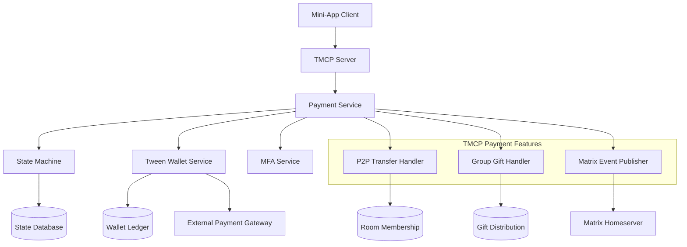
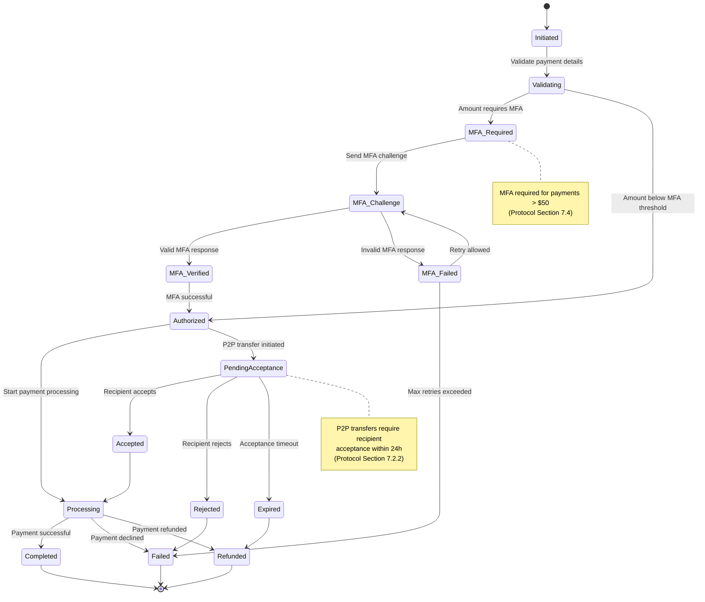
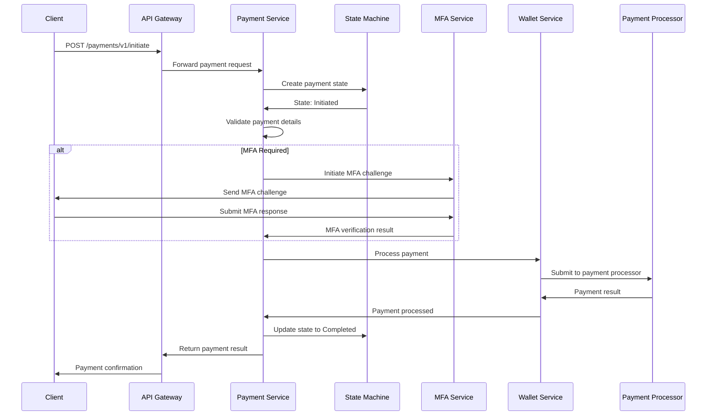
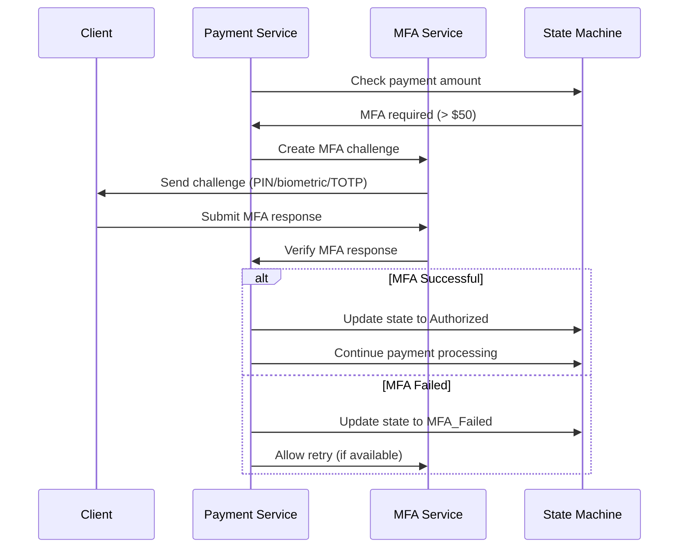
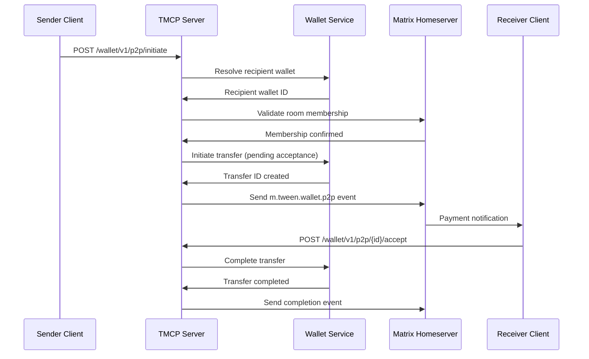
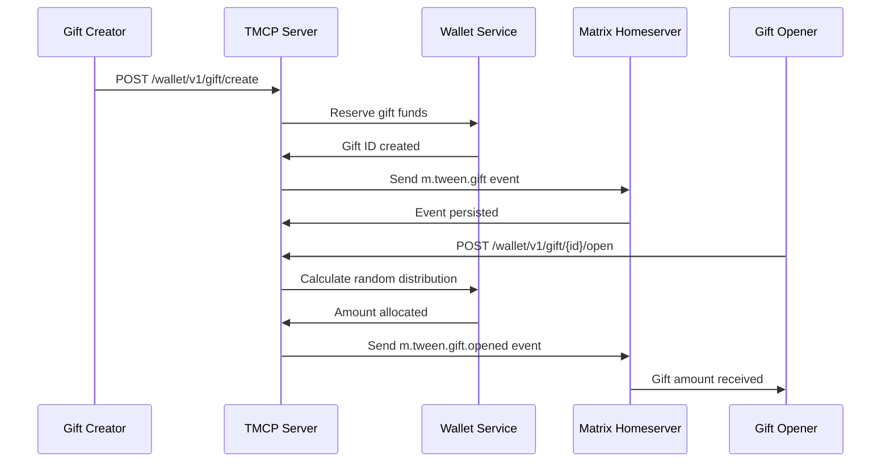

# TMCP Payment Processing System Design

## 1. Overview

The TMCP Payment Processing System implements the complete payment protocol as specified in TMCP v1.2.0, including peer-to-peer transfers with recipient acceptance, group gift distribution, mini-app payments with MFA, and Matrix event integration. It coordinates with the Tween Wallet Service for all financial operations.

## 2. System Architecture



## 3. Payment State Machine

### 3.1 State Diagram



### 3.2 State Transitions Table

| Current State | Event | Next State | Conditions |
|---------------|-------|------------|------------|
| Initiated | validate | Validating | Valid payment request |
| Initiated | cancel | Failed | User cancellation |
| Validating | mfa_required | MFA_Required | Amount > threshold |
| Validating | authorized | Authorized | Amount ≤ threshold |
| Validating | invalid | Failed | Invalid payment details |
| MFA_Required | challenge_sent | MFA_Challenge | MFA method available |
| MFA_Challenge | mfa_verified | MFA_Verified | Valid MFA response |
| MFA_Challenge | mfa_failed | MFA_Failed | Invalid MFA response |
| MFA_Challenge | max_retries | Failed | Retry limit exceeded |
| MFA_Verified | authorized | Authorized | MFA successful |
| Authorized | process | Processing | Start payment processing |
| Processing | completed | Completed | Payment successful |
| Processing | declined | Failed | Payment declined |
| Processing | refund | Refunded | Payment refunded |
| Failed | retry | Initiated | Retry allowed |
| Refunded | retry | Initiated | Retry allowed |

## 4. API Design

### 4.1 Payment Operations

```
POST /api/v1/payments/request - Mini-app payment request (Section 7.3)
GET /api/v1/payments/{paymentId} - Get payment status
POST /api/v1/payments/{paymentId}/authorize - Authorize payment with MFA
POST /api/v1/payments/{paymentId}/cancel - Cancel payment
POST /api/v1/payments/{paymentId}/refund - Refund payment

POST /wallet/v1/p2p/initiate - Initiate P2P transfer (Section 7.2.1)
POST /wallet/v1/p2p/{transferId}/accept - Accept P2P transfer
POST /wallet/v1/p2p/{transferId}/reject - Reject P2P transfer

POST /wallet/v1/gift/create - Create group gift (Section 7.5.1)
POST /wallet/v1/gift/{giftId}/open - Open group gift
```

### 4.2 MFA Operations

```
POST /payments/v1/{paymentId}/mfa/challenge
POST /payments/v1/{paymentId}/mfa/verify
GET /payments/v1/{paymentId}/mfa/status
```

### 4.3 Query Operations

```
GET /payments/v1/user/{userId}/transactions
GET /payments/v1/user/{userId}/balance
GET /payments/v1/user/{userId}/payment-methods
```

## 5. Payment Flow

### 5.1 Standard Payment Flow



### 5.2 Payment with MFA Flow (Protocol Section 7.4)



### 5.3 P2P Transfer Flow (Protocol Section 7.2)



### 5.4 Group Gift Distribution Flow (Protocol Section 7.5)



## 6. Component Details

### 6.1 Payment Service (Protocol Sections 7.2-7.5)

**Responsibilities:**
- Payment request validation for mini-app and P2P payments
- State machine orchestration with protocol-compliant states
- MFA integration for high-value transactions
- P2P transfer coordination with recipient acceptance
- Group gift distribution and opening
- Wallet service communication
- Matrix event publishing for payment events
- Transaction logging and audit trails

**Key Features:**
- Multi-currency support
- Multiple payment methods
- Transaction limits and controls
- Refund processing
- Dispute handling

### 6.2 State Machine

**Responsibilities:**
- Payment state management
- State transition validation
- Event handling
- State persistence
- Timeout management

**State Persistence:**
```sql
CREATE TABLE payment_states (
    payment_id UUID PRIMARY KEY,
    current_state VARCHAR(50) NOT NULL,
    previous_state VARCHAR(50),
    event_history JSONB,
    created_at TIMESTAMP DEFAULT NOW(),
    updated_at TIMESTAMP DEFAULT NOW(),
    expires_at TIMESTAMP
);
```

### 6.3 MFA Integration

**MFA Triggers:**
- Amount > $50 (configurable)
- High-risk transactions
- User preference settings
- Unusual payment patterns
- New payment methods

**MFA Methods:**
1. **Transaction PIN** - 6-digit PIN
2. **Biometric** - Fingerprint/Face ID
3. **TOTP** - Time-based codes

### 6.4 P2P Transfer Handler (Protocol Section 7.2)

**Responsibilities:**
- Matrix User ID to Wallet ID resolution
- Room membership validation for transfers
- 24-hour acceptance window management
- Transfer state management (pending → accepted/rejected/expired)
- Matrix event publishing for transfer lifecycle

### 6.5 Group Gift Handler (Protocol Section 7.5)

**Responsibilities:**
- Random distribution algorithm implementation
- Gift expiration and timeout handling
- Leaderboard and ranking calculations
- Multi-recipient fund allocation
- Gift opening coordination

### 6.6 Matrix Event Publisher (Protocol Section 8)

**Responsibilities:**
- Publishing payment-related Matrix events
- m.tween.payment.completed for mini-app payments
- m.tween.wallet.p2p for P2P transfers
- m.tween.gift events for group gifts
- Event formatting and room targeting

### 6.7 Wallet Service Integration (Protocol Section 6)

**Responsibilities:**
- User wallet management and balance queries
- Payment method handling
- Transaction processing coordination
- External payment gateway integration
- Wallet ID resolution and mapping

**Wallet Features:**
- Multiple payment methods
- Balance tracking
- Transaction history
- Auto-recharge options
- Spending limits

## 7. Data Models

### 7.1 Payment Transaction Model

```json
{
  "paymentId": "uuid",
  "userId": "uuid",
  "appId": "uuid",
  "amount": {
    "value": 9999,
    "currency": "USD"
  },
  "paymentMethod": {
    "type": "card",
    "id": "pm_123",
    "last4": "4242"
  },
  "description": "Premium subscription",
  "metadata": {
    "orderId": "order_123",
    "items": ["premium_plan"]
  },
  "status": "completed",
  "state": "Completed",
  "mfaRequired": true,
  "mfaMethod": "transaction_pin",
  "createdAt": "2025-12-20T01:15:00Z",
  "updatedAt": "2025-12-20T01:18:00Z",
  "completedAt": "2025-12-20T01:18:00Z"
}
```

### 7.2 MFA Challenge Model

```json
{
  "challengeId": "uuid",
  "paymentId": "uuid",
  "userId": "uuid",
  "method": "transaction_pin",
  "status": "pending",
  "attempts": 0,
  "maxAttempts": 3,
  "expiresAt": "2025-12-20T01:20:00Z",
  "createdAt": "2025-12-20T01:15:00Z"
}
```

### 7.3 P2P Transfer Model (Protocol Section 7.2)

```json
{
  "transfer_id": "p2p_abc123",
  "status": "pending_recipient_acceptance",
  "amount": 5000.00,
  "currency": "USD",
  "sender": {
    "user_id": "@alice:tween.example",
    "wallet_id": "tw_user_12345"
  },
  "recipient": {
    "user_id": "@bob:tween.example",
    "wallet_id": "tw_user_67890"
  },
  "note": "Lunch money",
  "room_id": "!chat123:tween.example",
  "expires_at": "2025-12-19T14:30:00Z",
  "created_at": "2025-12-18T14:30:00Z"
}
```

### 7.4 Group Gift Model (Protocol Section 7.5)

```json
{
  "gift_id": "gift_abc123",
  "type": "group",
  "status": "active",
  "total_amount": 10000.00,
  "currency": "USD",
  "count": 10,
  "remaining": 7,
  "distribution": "random",
  "message": "Happy Friday! 🎁",
  "creator": {
    "user_id": "@alice:tween.example",
    "wallet_id": "tw_user_12345"
  },
  "opened_by": [
    {"user_id": "@bob:tween.example", "amount": 1250.00},
    {"user_id": "@charlie:tween.example", "amount": 1500.00}
  ],
  "expires_at": "2025-12-19T14:30:00Z",
  "room_id": "!groupchat:tween.example"
}
```

## 8. Database Schema

### 8.1 Payment Transactions Table

```sql
CREATE TABLE payment_transactions (
    payment_id UUID PRIMARY KEY,
    user_id UUID NOT NULL,
    app_id UUID NOT NULL,
    amount BIGINT NOT NULL,
    currency VARCHAR(3) NOT NULL,
    payment_method_id UUID,
    description TEXT,
    metadata JSONB,
    status VARCHAR(50) NOT NULL,
    state VARCHAR(50) NOT NULL,
    mfa_required BOOLEAN DEFAULT FALSE,
    mfa_method VARCHAR(50),
    processor_id VARCHAR(255),
    processor_transaction_id VARCHAR(255),
    created_at TIMESTAMP DEFAULT NOW(),
    updated_at TIMESTAMP DEFAULT NOW(),
    completed_at TIMESTAMP
);

CREATE INDEX idx_payment_transactions_user ON payment_transactions(user_id);
CREATE INDEX idx_payment_transactions_status ON payment_transactions(status);
CREATE INDEX idx_payment_transactions_created ON payment_transactions(created_at);
```

### 8.2 Payment Methods Table

```sql
CREATE TABLE payment_methods (
    id UUID PRIMARY KEY,
    user_id UUID NOT NULL,
    type VARCHAR(50) NOT NULL,
    provider VARCHAR(50) NOT NULL,
    provider_method_id VARCHAR(255) NOT NULL,
    method_data JSONB NOT NULL,
    is_default BOOLEAN DEFAULT FALSE,
    is_active BOOLEAN DEFAULT TRUE,
    metadata JSONB,
    created_at TIMESTAMP DEFAULT NOW(),
    updated_at TIMESTAMP DEFAULT NOW()
);

CREATE INDEX idx_payment_methods_user ON payment_methods(user_id);
CREATE UNIQUE INDEX idx_payment_methods_provider ON payment_methods(provider, provider_method_id);
```

### 8.3 P2P Transfers Table (Protocol Section 7.2)

```sql
CREATE TABLE p2p_transfers (
    transfer_id VARCHAR(255) PRIMARY KEY,
    status VARCHAR(50) NOT NULL,
    amount BIGINT NOT NULL,
    currency VARCHAR(3) NOT NULL DEFAULT 'USD',
    sender_user_id VARCHAR(255) NOT NULL,
    sender_wallet_id VARCHAR(255) NOT NULL,
    recipient_user_id VARCHAR(255) NOT NULL,
    recipient_wallet_id VARCHAR(255),
    note TEXT,
    room_id VARCHAR(255),
    expires_at TIMESTAMP,
    accepted_at TIMESTAMP,
    rejected_at TIMESTAMP,
    created_at TIMESTAMP DEFAULT NOW()
);

CREATE INDEX idx_p2p_transfers_sender ON p2p_transfers(sender_user_id);
CREATE INDEX idx_p2p_transfers_recipient ON p2p_transfers(recipient_user_id);
CREATE INDEX idx_p2p_transfers_status ON p2p_transfers(status);
```

### 8.4 Group Gifts Table (Protocol Section 7.5)

```sql
CREATE TABLE group_gifts (
    gift_id VARCHAR(255) PRIMARY KEY,
    type VARCHAR(20) DEFAULT 'group',
    status VARCHAR(50) NOT NULL,
    total_amount BIGINT NOT NULL,
    currency VARCHAR(3) NOT NULL DEFAULT 'USD',
    count INTEGER NOT NULL,
    remaining INTEGER NOT NULL,
    distribution VARCHAR(20) DEFAULT 'random',
    message TEXT,
    creator_user_id VARCHAR(255) NOT NULL,
    creator_wallet_id VARCHAR(255) NOT NULL,
    room_id VARCHAR(255),
    expires_at TIMESTAMP,
    created_at TIMESTAMP DEFAULT NOW()
);

CREATE TABLE gift_openings (
    id UUID PRIMARY KEY DEFAULT gen_random_uuid(),
    gift_id VARCHAR(255) REFERENCES group_gifts(gift_id),
    user_id VARCHAR(255) NOT NULL,
    amount BIGINT NOT NULL,
    opened_at TIMESTAMP DEFAULT NOW()
);

CREATE INDEX idx_group_gifts_creator ON group_gifts(creator_user_id);
CREATE INDEX idx_group_gifts_room ON group_gifts(room_id);
CREATE INDEX idx_gift_openings_gift ON gift_openings(gift_id);
```

## 9. Security Considerations

### 9.1 Payment Security

**Data Protection:**
- PCI DSS compliance for card data
- Tokenization of sensitive payment information
- Encryption of payment details at rest
- Secure transmission with TLS

**Fraud Prevention:**
- Transaction velocity limits
- Device fingerprinting
- Behavioral analysis
- Risk scoring for transactions

### 9.2 MFA Security

**MFA Requirements:**
- Amount-based triggers
- Frequency-based triggers
- Location-based triggers
- User preference settings

**MFA Security:**
- Rate limiting for MFA attempts
- Secure challenge generation
- Time-limited challenges
- Secure verification process

## 10. Error Handling

### 10.1 Payment Error Codes

| Error Code | Description | HTTP Status |
|------------|-------------|-------------|
| PAYMENT_REQUIRED | Payment method required | 402 |
| INSUFFICIENT_FUNDS | Insufficient balance | 402 |
| PAYMENT_DECLINED | Payment declined by processor | 402 |
| MFA_REQUIRED | MFA challenge required | 428 |
| MFA_FAILED | MFA verification failed | 401 |
| INVALID_AMOUNT | Invalid payment amount | 400 |
| EXPIRED_CARD | Expired payment method | 400 |
| PROCESSOR_ERROR | Payment processor error | 502 |

### 10.2 Error Response Format

```json
{
  "error": {
    "code": "MFA_REQUIRED",
    "message": "Multi-factor authentication is required for this payment",
    "details": {
      "paymentId": "uuid",
      "mfaMethods": ["transaction_pin", "biometric", "totp"],
      "challengeId": "uuid"
    }
  }
}
```

## 11. Monitoring and Observability

### 11.1 Key Metrics

**Payment Metrics:**
- Transaction volume and value
- Success/failure rates
- Processing latency
- MFA challenge success rates

**Financial Metrics:**
- Revenue tracking
- Refund rates
- Chargeback rates
- Payment method distribution

### 11.2 Alerting

**Critical Alerts:**
- Payment service unavailable
- High failure rates
- Security incidents
- Processor connectivity issues

**Warning Alerts:**
- Increased MFA failures
- Processing latency spikes
- Unusual transaction patterns

## 11. TMCP Protocol Compliance

### 11.1 Implemented Protocol Features

**Payment State Machine (Section 7.1):**
- Complete state transitions including MFA_REQUIRED
- P2P transfer states with recipient acceptance
- Group gift lifecycle management

**P2P Transfers (Section 7.2):**
- Matrix User ID to Wallet ID resolution
- 24-hour acceptance window
- Room membership validation
- Transfer cancellation and expiry

**Mini-App Payments (Section 7.3):**
- Payment request flow with merchant integration
- Hardware-backed authorization
- Transaction signing and verification

**MFA Integration (Section 7.4):**
- Transaction PIN, biometric, and TOTP support
- Challenge-response protocol
- Device registration for biometrics

**Group Gifts (Section 7.5):**
- Random and equal distribution algorithms
- Multi-recipient fund allocation
- Gift expiration and leaderboard

**Matrix Events (Section 8):**
- m.tween.payment.completed
- m.tween.wallet.p2p and status events
- m.tween.gift and opened events

### 11.2 Wallet Service Integration (Section 6)

**Core Interfaces:**
- Balance queries and wallet resolution
- Transfer execution and settlement
- Fund reservation for gifts
- Transaction history and reconciliation

This design fully implements the TMCP payment protocol with integrated P2P transfers, group gifts, and Matrix event coordination as specified in TMCP v1.2.0.